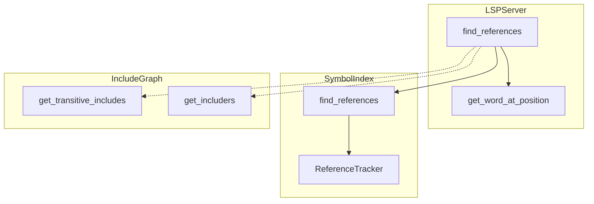
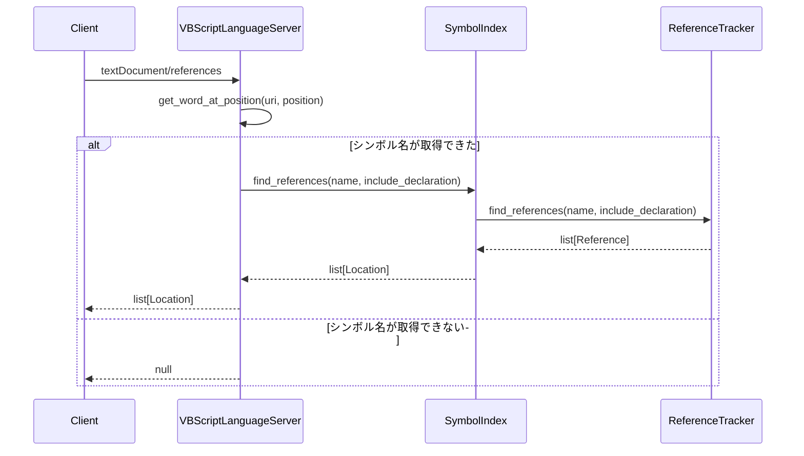

# Design Document: cross-file-references

## Overview

**Purpose**: VBScript LSPの`textDocument/references`機能を拡張し、ワークスペース初期スキャンで構築されたインデックスを活用してプロジェクト全体から参照を検索できるようにする。

**Users**: VBScript/ASP開発者がSerena経由でシンボルの参照箇所を検索する際、ファイルを個別に開くことなくプロジェクト全体の参照を取得できる。

**Impact**: 現在の「開いたファイルのみ」の参照検索から「全インデックスファイル」を対象とした参照検索に変更し、リファクタリングや影響範囲調査のワークフローを改善する。

### Goals
- 全インデックス済みファイルからシンボル参照を検索
- Include依存関係を考慮した参照検索スコープの提供
- 1000ファイル規模で1秒以内の参照検索完了
- 参照結果の一貫性と重複排除

### Non-Goals
- workspace/symbol LSPリクエスト対応（別機能）
- 参照結果のフィルタリングUI（クライアント側の責務）
- リアルタイムファイル変更監視（別機能）

## Architecture

### Existing Architecture Analysis

**現在の参照検索フロー**:
```
クライアントからtextDocument/references
    ↓
find_references(params)
    ↓
_documents.get(uri) → コンテンツ取得
    ↓
get_word_at_position() → シンボル名抽出
    ↓
SymbolIndex.find_references() → ReferenceTracker.find_references()
```

**既存コンポーネント**:
- `VBScriptLanguageServer.find_references()` (server.py): LSPハンドラ
- `SymbolIndex.find_references()` (index.py): 参照検索の委譲
- `ReferenceTracker` (reference_tracker.py): 実際の参照インデックス管理
- `IncludeGraph` (include_graph.py): Include依存関係の追跡

**課題**:
- `find_references()`は`_documents`キャッシュの存在をチェックするが、実際の検索は`ReferenceTracker`が全インデックスファイルを対象に実行可能
- Include依存関係を考慮した検索スコープ制御が未実装

### Architecture Pattern & Boundary Map



**Architecture Integration**:
- **Selected pattern**: 既存ReferenceTracker活用 + ドキュメントキャッシュ依存除去
- **Domain boundaries**: server.py内の`find_references()`のみ変更、他コンポーネントは既存のまま
- **Existing patterns preserved**: `ReferenceTracker`によるインデックス管理、`IncludeGraph`による依存関係追跡
- **New components rationale**: 新規コンポーネントは不要、既存インターフェースの活用
- **Steering compliance**: Language Server Pattern、Symbol-centric APIに準拠

### Technology Stack

| Layer | Choice / Version | Role in Feature | Notes |
|-------|------------------|-----------------|-------|
| Backend | Python 3.11 | 参照検索実装 | 既存要件 |
| Framework | pygls | LSPサーバー | 既存使用 |
| Data Structure | dict[str, list[Reference]] | 参照インデックス | 既存ReferenceTracker |

## System Flows

### 全インデックスファイルからの参照検索フロー



**Key Decisions**:
- `_documents`キャッシュの存在チェックを除去し、インデックスから直接検索
- シンボル名取得のためにインデックスからコンテンツを取得する方式に変更
- エラー時はnullを返却（LSP仕様準拠）

## Requirements Traceability

| Requirement | Summary | Components | Interfaces | Flows |
|-------------|---------|------------|------------|-------|
| 1.1 | 全インデックスファイルから参照検索 | VBScriptLanguageServer.find_references | SymbolIndex.find_references | 参照検索フロー |
| 1.2 | 未オープンファイルからの参照 | VBScriptLanguageServer.find_references | - | 参照検索フロー |
| 1.3 | 大文字小文字を区別しない検索 | ReferenceTracker | - | - |
| 1.4 | シンボル未発見時の空リスト返却 | VBScriptLanguageServer.find_references | - | - |
| 2.1 | Include経由の参照検索 | ReferenceTracker（既存動作） | - | - |
| 2.2 | IncludeファイルのシンボルへのIncluder検索 | ReferenceTracker（既存動作） | - | - |
| 2.3 | 循環Include時の無限ループ防止 | IncludeGraph.get_transitive_includes | - | - |
| 3.1 | include_declaration=trueで定義含む | ReferenceTracker.find_references | - | - |
| 3.2 | include_declaration=falseで定義除外 | ReferenceTracker.find_references | - | - |
| 3.3 | 統一的な参照結果返却 | SymbolIndex.find_references | - | - |
| 3.4 | 重複なし返却 | VBScriptLanguageServer.find_references | - | - |
| 4.1 | 1000ファイルで1秒以内 | ReferenceTracker | _references_by_name | - |
| 4.2 | インデックス再構築なし | VBScriptLanguageServer.find_references | - | - |
| 4.3 | メモリ効率的な管理 | ReferenceTracker（既存） | - | - |
| 5.1 | シンボル未存在時null返却 | VBScriptLanguageServer.find_references | - | - |
| 5.2 | ドキュメント未インデックス時null返却 | VBScriptLanguageServer.find_references | - | - |
| 5.3 | 内部エラーのログ出力 | VBScriptLanguageServer.find_references | logger | - |

## Components and Interfaces

| Component | Domain/Layer | Intent | Req Coverage | Key Dependencies | Contracts |
|-----------|--------------|--------|--------------|------------------|-----------|
| VBScriptLanguageServer.find_references | LSP Server | 参照検索ハンドラの拡張 | 1.1-1.4, 3.4, 4.2, 5.1-5.3 | SymbolIndex (P0), ReferenceTracker (P0) | Service |
| SymbolIndex | Index Layer | 参照検索の委譲（変更なし） | 1.3, 3.1-3.3, 4.1, 4.3 | ReferenceTracker (P0) | Service |
| ReferenceTracker | Index Layer | 参照インデックス管理（変更なし） | 2.1-2.2, 1.3, 3.1-3.3 | - | Service |
| IncludeGraph | Index Layer | Include依存関係追跡（変更なし） | 2.3 | - | Service |

### LSP Server Layer

#### VBScriptLanguageServer.find_references (拡張)

| Field | Detail |
|-------|--------|
| Intent | 全インデックスファイルから参照を検索するようハンドラを拡張 |
| Requirements | 1.1, 1.2, 1.4, 3.4, 4.2, 5.1, 5.2, 5.3 |

**Responsibilities & Constraints**
- インデックス済み全ファイルから参照を検索
- `_documents`キャッシュへの依存を除去
- エラー発生時は適切にログ出力してnull返却

**Dependencies**
- Inbound: LSP Client — textDocument/references要求 (P0)
- Internal: SymbolIndex.find_references — 参照検索 (P0)
- Internal: SymbolIndex.get_document_content — コンテンツ取得 (P0)

**Contracts**: Service [x]

##### Service Interface

```python
def find_references(
    self, params: types.ReferenceParams
) -> list[types.Location] | None:
    """全インデックスファイルからシンボルの参照を検索

    Args:
        params: LSP ReferenceParams（URI、位置、コンテキスト）

    Returns:
        参照位置のリスト、シンボル未発見またはエラー時はNone
    """
    ...
```

- Preconditions: `params.text_document.uri`がインデックス済み
- Postconditions: シンボルの全参照位置を返却、重複なし
- Invariants: インデックスは変更されない

**Implementation Notes**
- Integration: `_documents.get(uri)`を`_index.get_document_content(uri)`に変更
- Validation: URI未インデックス時はNone返却
- Risks: コンテンツ取得方法の変更による副作用（テストで確認）

### Index Layer

#### SymbolIndex (変更あり)

| Field | Detail |
|-------|--------|
| Intent | ドキュメントコンテンツの取得メソッドを追加 |
| Requirements | 1.1, 1.2 |

**Responsibilities & Constraints**
- URIに対応するドキュメントコンテンツを返却
- 未インデックスURIに対してはNone返却

**Dependencies**
- Internal: _documents_content — コンテンツ格納 (P0)

**Contracts**: Service [x]

##### Service Interface

```python
def get_document_content(self, uri: str) -> str | None:
    """インデックス済みドキュメントのコンテンツを取得

    Args:
        uri: ドキュメントURI

    Returns:
        ドキュメントコンテンツ、未インデックス時はNone
    """
    ...
```

- Preconditions: なし
- Postconditions: インデックス済みならコンテンツを返却
- Invariants: インデックスは変更されない

##### State Management

**追加属性**:
```python
# URIからコンテンツへのマップ
_documents_content: dict[str, str] = {}
```

**`update()`メソッドの変更**:
- 既存の処理に加えて`_documents_content[uri] = content`を追加

**`remove()`メソッドの変更**:
- 既存の処理に加えて`_documents_content`からURIを削除

**Implementation Notes**
- Integration: `update()`でコンテンツを保存、`remove()`で削除
- Validation: None返却でエラーケースを処理
- Risks: メモリ使用量増加（ただしサーバー側で既に保持していたものをインデックス側に移動するだけ）

## Data Models

### Domain Model

本機能は新規データモデルを導入しない。既存の`Reference`、`IndexedSymbol`、`IncludeDirective`をそのまま使用する。

**既存データ構造（変更なし）**:
- `Reference`: 参照情報（名前、位置、定義フラグ）
- `IndexedSymbol`: シンボル定義情報
- `IncludeDirective`: Include情報

**追加する状態**:
- `SymbolIndex._documents_content`: URIからドキュメントコンテンツへのマップ

## Error Handling

### Error Strategy

参照検索は「ベストエフォート」方式を採用。シンボルが見つからない場合や内部エラーは適切にハンドリングし、クライアントに意味のあるレスポンスを返却する。

### Error Categories and Responses

| エラー種別 | 原因 | 対応 | ログレベル |
|-----------|------|------|-----------|
| シンボル未発見 | カーソル位置に識別子なし | null返却 | DEBUG |
| URI未インデックス | ドキュメントがスキャン対象外 | null返却 | DEBUG |
| 参照未発見 | シンボルへの参照が存在しない | 空リスト返却 | DEBUG |
| 内部エラー | 予期しない例外 | null返却、例外ログ | ERROR |

### Monitoring

- DEBUG: 参照検索リクエスト受信、シンボル名抽出結果
- INFO: 検索結果件数（オプション）
- ERROR: 内部例外発生時

## Testing Strategy

### Unit Tests
- `SymbolIndex.get_document_content()`: 正常取得、未インデックスURI
- `find_references()`のnull返却条件: シンボルなし、URI未インデックス
- 重複参照の除去確認

### Integration Tests
- 複数ファイルにまたがる参照検索（テストリポジトリ使用）
- Include経由の参照検索（A includes B、Bのシンボルへの参照をAから検索）
- 循環Includeを含むプロジェクトでの参照検索

### E2E Tests
- サーバー起動後の`textDocument/references`リクエスト
- `include_declaration=true/false`の動作確認
- 未オープンファイルのシンボルへの参照検索

### Performance Tests
- 1000ファイルプロジェクトでの参照検索時間計測
- 参照数が多いシンボル（100件以上）の検索時間

## Performance & Scalability

### Target Metrics
- 1000ファイル規模: 参照検索1秒以内
- 検索計算量: O(1)シンボル名ルックアップ + O(n)参照リスト走査（nは参照数）

### Design for Performance
- `ReferenceTracker._references_by_name`のO(1)ルックアップを活用
- インデックス再構築は行わない（既存インデックスを使用）
- 重複除去はLocation比較で実装（ハッシュ計算のオーバーヘッド回避）

### Monitoring Points
- 参照検索時間
- 返却された参照数
- メモリ使用量（`_documents_content`追加分）
