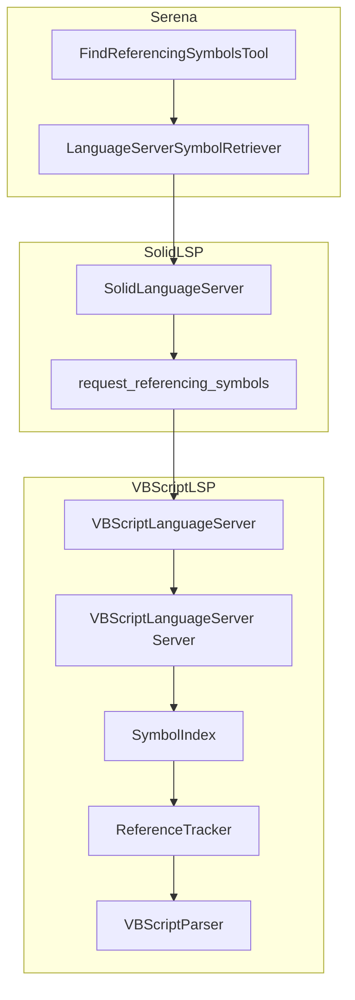
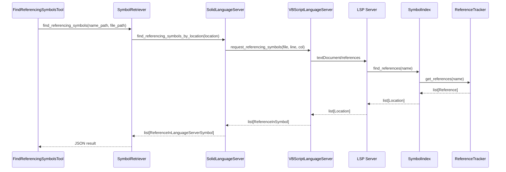

# Design Document

## Overview

**Purpose**: VBScript言語サーバーに`find_referencing_symbols`機能を追加し、シンボルが参照されている箇所をコードベース全体から検索できるようにする。

**Users**: コードリファクタリングや影響範囲分析を行う開発者、LLMエージェントワークフローを構築するシステム。

**Impact**: 現在のVBScript LSPサーバーは`textDocument/references`リクエストに対して宣言のみを返す状態。本機能の実装により、実際の参照（関数呼び出し、変数使用箇所）を検索可能になる。

### Goals
- VBScriptコード内でシンボルの参照箇所を正確に検索できる
- 複数ファイルにまたがる参照を統合して返却できる
- 既存のSerenaツール（`FindReferencingSymbolsTool`）と互換性を維持する

### Non-Goals
- 完全なAST解析による100%正確な参照検出（将来の拡張として検討）
- リファクタリング機能（名前変更、移動）の実装
- インクルードファイルの解決と追跡（将来の拡張）

## Architecture

> 詳細な調査内容は`research.md`を参照。

### Existing Architecture Analysis

現在のアーキテクチャ構成:

1. **Serenaツール層** (`src/serena/tools/symbol_tools.py`)
   - `FindReferencingSymbolsTool`: MCPツールとして公開済み
   - `LanguageServerSymbolRetriever`を介してLSPに委譲

2. **Serenaシンボル層** (`src/serena/symbol.py`)
   - `LanguageServerSymbolRetriever.find_referencing_symbols`: LSPリクエストを発行
   - `find_referencing_symbols_by_location`: 位置情報ベースの検索

3. **SolidLSP層** (`src/solidlsp/ls.py`)
   - `SolidLanguageServer.request_referencing_symbols`: LSP `textDocument/references`を呼び出し
   - `request_references`: 生の参照リストを取得

4. **VBScript LSP層** (`src/solidlsp/language_servers/vbscript_lsp/`)
   - `VBScriptLanguageServer`: SolidLanguageServerのサブクラス
   - `SymbolIndex`: シンボルインデックス（現在は宣言のみ追跡）
   - `VBScriptParser`: VBScriptコードの解析

**問題点**: `SymbolIndex.find_references()`が宣言のみを返し、実際の参照を追跡していない。

### Architecture Pattern & Boundary Map



**Architecture Integration**:
- Selected pattern: 既存のレイヤー構造を維持し、VBScript LSP層のみを拡張
- Domain boundaries: VBScript LSP内部で参照追跡を完結（Serena/SolidLSP層は変更なし）
- Existing patterns preserved: Tool → Retriever → LanguageServer の呼び出しチェーン
- New components rationale: `ReferenceTracker`を追加してシンボル参照を追跡
- Steering compliance: パッケージ中心の組織構造、明確な責任分離を維持

### Technology Stack

| Layer | Choice / Version | Role in Feature | Notes |
|-------|------------------|-----------------|-------|
| Backend / Services | Python 3.11 | VBScript LSPサーバー実装 | 既存と同一 |
| Backend / Services | pygls | LSPサーバーフレームワーク | 既存と同一 |
| Data / Storage | In-memory dict | 参照インデックス | `SymbolIndex`を拡張 |

## System Flows

### 参照検索フロー



**Key Decisions**:
- 参照追跡は`ReferenceTracker`に委譲し、`SymbolIndex`は集約のみ担当
- ファイル解析時に参照を事前収集してインデックス化

## Requirements Traceability

| Requirement | Summary | Components | Interfaces | Flows |
|-------------|---------|------------|------------|-------|
| 1.1 | シンボル参照の検索 | ReferenceTracker, SymbolIndex | find_references | 参照検索フロー |
| 1.2 | 位置情報の返却 | SymbolIndex, Reference | Location型 | 参照検索フロー |
| 1.3 | 存在しないシンボル | SymbolIndex | find_references | N/A |
| 1.4 | 全参照タイプ対応 | ReferenceTracker | track_reference | 参照検索フロー |
| 2.1 | 複数ファイル検索 | SymbolIndex | find_references | 参照検索フロー |
| 2.2 | 結果統合 | SymbolIndex | find_references | 参照検索フロー |
| 2.3 | インクルードファイル | — | — | 将来対応 |
| 3.1 | コード行の提供 | SolidLanguageServer | request_referencing_symbols | 参照検索フロー |
| 3.2 | 親シンボル情報 | SolidLanguageServer | request_containing_symbol | 参照検索フロー |
| 3.3 | 定義/参照の区別 | Reference | is_definition | 参照検索フロー |
| 4.1 | MCPツール公開 | FindReferencingSymbolsTool | — | 既存実装 |
| 4.2 | パラメータ受け取り | FindReferencingSymbolsTool | apply() | 既存実装 |
| 4.3 | 結果形式 | FindReferencingSymbolsTool | — | 既存実装 |
| 4.4 | エラーハンドリング | SolidLanguageServer | — | 既存実装 |
| 5.1 | インデックス活用 | SymbolIndex | — | 参照検索フロー |
| 5.2 | 部分結果返却 | SymbolIndex | find_references | 参照検索フロー |
| 5.3 | ログ記録 | VBScriptLanguageServer | — | 参照検索フロー |

## Components and Interfaces

| Component | Domain/Layer | Intent | Req Coverage | Key Dependencies | Contracts |
|-----------|--------------|--------|--------------|------------------|-----------|
| ReferenceTracker | VBScript LSP | シンボル参照の追跡と検索 | 1.1, 1.4, 2.1 | Parser (P0) | Service |
| SymbolIndex (拡張) | VBScript LSP | 参照インデックスの管理 | 1.2, 1.3, 2.2, 5.1, 5.2 | ReferenceTracker (P0) | Service |
| Reference | VBScript LSP | 参照データの表現 | 3.3 | — | State |
| VBScriptParser (拡張) | VBScript LSP | 参照箇所の抽出 | 1.4 | — | Service |

### VBScript LSP Layer

#### ReferenceTracker

| Field | Detail |
|-------|--------|
| Intent | VBScriptコード内のシンボル参照を追跡・検索する |
| Requirements | 1.1, 1.4, 2.1 |

**Responsibilities & Constraints**
- シンボル参照の識別と位置情報の抽出
- VBScript構文を考慮した参照パターンマッチング
- コメント・文字列内の誤検出を除外

**Dependencies**
- Inbound: SymbolIndex — 参照検索の委譲 (P0)
- Outbound: VBScriptParser — 構文情報の取得 (P0)

**Contracts**: Service [x]

##### Service Interface
```python
@dataclass
class Reference:
    """シンボル参照を表すデータクラス"""
    name: str
    uri: str
    line: int
    character: int
    end_line: int
    end_character: int
    is_definition: bool = False
    container_name: str | None = None

class ReferenceTracker:
    """シンボル参照の追跡と検索を担当"""

    def __init__(self) -> None:
        """初期化"""
        ...

    def update(self, uri: str, content: str, symbols: list[ParsedSymbol]) -> None:
        """ドキュメントの参照情報を更新

        Args:
            uri: ドキュメントURI
            content: ドキュメント内容
            symbols: 解析済みシンボルリスト
        """
        ...

    def remove(self, uri: str) -> None:
        """ドキュメントの参照情報を削除

        Args:
            uri: ドキュメントURI
        """
        ...

    def find_references(
        self,
        name: str,
        include_declaration: bool = False
    ) -> list[Reference]:
        """シンボル名に対する参照を検索

        Args:
            name: シンボル名（大文字小文字を区別しない）
            include_declaration: 宣言を含めるかどうか

        Returns:
            参照のリスト
        """
        ...
```

- Preconditions: ドキュメントが`update()`で登録済みであること
- Postconditions: 参照リストが返却される（空リストの場合あり）
- Invariants: 参照情報は常にシンボル定義と同期

**Implementation Notes**
- Integration: `SymbolIndex.update()`から呼び出される
- Validation: VBScript識別子パターンに合致する参照のみ追跡
- Risks: 複雑な構文パターンで誤検出の可能性あり

#### SymbolIndex (拡張)

| Field | Detail |
|-------|--------|
| Intent | シンボル定義と参照のインデックス管理 |
| Requirements | 1.2, 1.3, 2.2, 5.1, 5.2 |

**Responsibilities & Constraints**
- 既存のシンボル定義インデックス機能を維持
- `ReferenceTracker`との統合
- 参照検索結果の`Location`型への変換

**Dependencies**
- Inbound: VBScriptLanguageServer Server — LSPリクエスト処理 (P0)
- Outbound: ReferenceTracker — 参照追跡 (P0)

**Contracts**: Service [x]

##### Service Interface (拡張部分)
```python
class SymbolIndex:
    def __init__(self) -> None:
        self._symbols_by_uri: dict[str, list[IndexedSymbol]] = {}
        self._symbols_by_name: dict[str, list[IndexedSymbol]] = {}
        self._reference_tracker: ReferenceTracker = ReferenceTracker()

    def update(self, uri: str, content: str, symbols: list[ParsedSymbol]) -> None:
        """インデックスを更新（参照追跡を含む）

        Args:
            uri: ドキュメントURI
            content: ドキュメント内容
            symbols: 解析済みシンボルリスト
        """
        # 既存のシンボルインデックス更新
        ...
        # 参照追跡の更新
        self._reference_tracker.update(uri, content, symbols)

    def find_references(
        self,
        name: str,
        include_declaration: bool = False
    ) -> list[types.Location]:
        """参照を検索（実装を変更）

        Args:
            name: シンボル名
            include_declaration: 宣言を含めるかどうか

        Returns:
            Location型のリスト
        """
        ...
```

- Preconditions: なし
- Postconditions: `Location`型のリストが返却される
- Invariants: シンボルインデックスと参照インデックスの整合性

**Implementation Notes**
- Integration: 既存の`update()`メソッドを拡張して`content`パラメータを追加
- Validation: URIの存在確認
- Risks: メモリ使用量の増加（大規模プロジェクト）

#### Reference (データモデル)

| Field | Detail |
|-------|--------|
| Intent | シンボル参照の位置と属性を表現 |
| Requirements | 3.3 |

**Contracts**: State [x]

##### State Management
```python
@dataclass
class Reference:
    """シンボル参照を表すデータクラス"""
    name: str                          # シンボル名
    uri: str                           # ドキュメントURI
    line: int                          # 開始行（0-indexed）
    character: int                     # 開始文字位置
    end_line: int                      # 終了行
    end_character: int                 # 終了文字位置
    is_definition: bool = False        # 定義かどうか
    container_name: str | None = None  # 含有シンボル名
```

- State model: 不変（immutable）データクラス
- Persistence: メモリ内のみ
- Concurrency: 読み取り専用のため競合なし

## Data Models

### Domain Model

**Aggregates**:
- `SymbolIndex`: シンボル定義と参照の集約ルート
  - `IndexedSymbol`: シンボル定義（既存）
  - `Reference`: シンボル参照（新規）

**Business Rules**:
- VBScriptは大文字小文字を区別しない → 検索は常にcase-insensitive
- 参照は定義より後に出現するとは限らない（前方参照許可）

### Logical Data Model

**Entity Relationships**:
```
SymbolIndex 1---* IndexedSymbol (by_uri, by_name)
SymbolIndex 1---1 ReferenceTracker
ReferenceTracker 1---* Reference (by_uri, by_name)
```

**Indexes**:
- `_symbols_by_uri`: URI → シンボルリスト
- `_symbols_by_name`: 小文字名 → シンボルリスト
- `_references_by_uri`: URI → 参照リスト
- `_references_by_name`: 小文字名 → 参照リスト

## Error Handling

### Error Strategy
- 参照追跡失敗時は警告ログを出力し、空リストを返却
- パース失敗したファイルはインデックスから除外
- 部分的な結果を返却可能（5.2対応）

### Error Categories and Responses
- **User Errors**: シンボルが見つからない → 空リスト返却
- **System Errors**: パースエラー → 警告ログ、該当ファイルスキップ
- **Business Logic Errors**: なし

### Monitoring
- `logger.warning`: パース失敗時のファイル情報
- `logger.info`: 参照検索の統計（件数、処理時間）

## Testing Strategy

### Unit Tests
- `ReferenceTracker.update()`: 参照抽出の正確性
- `ReferenceTracker.find_references()`: 検索結果の正確性
- `SymbolIndex.find_references()`: 統合動作
- 大文字小文字を区別しない検索
- コメント・文字列内の除外

### Integration Tests
- VBScript LSPサーバーの`textDocument/references`応答
- 複数ファイルにまたがる参照検索
- 既存の`FindReferencingSymbolsTool`との統合

### E2E Tests
- SerenaのMCPツールを介した参照検索
- 実際のVBScriptプロジェクトでの動作確認
