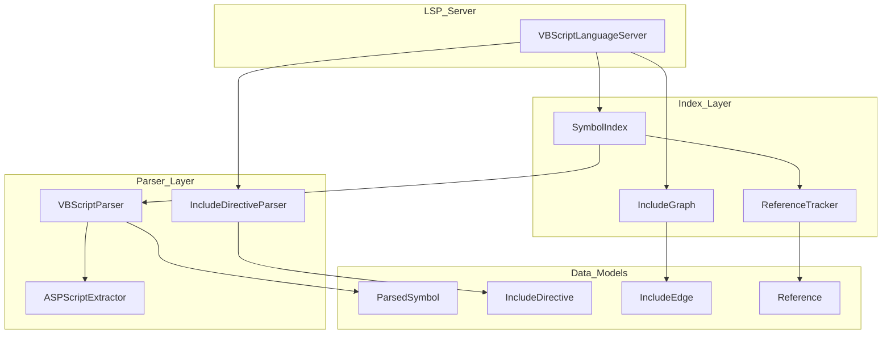
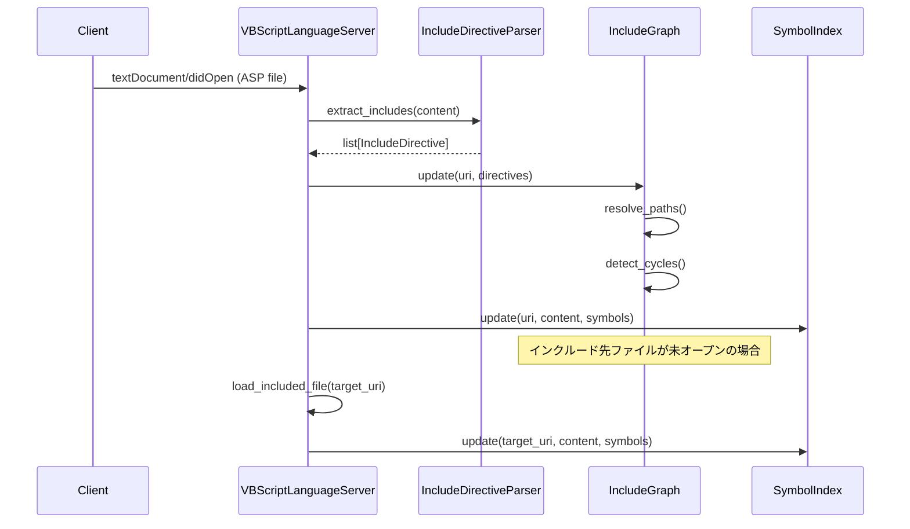
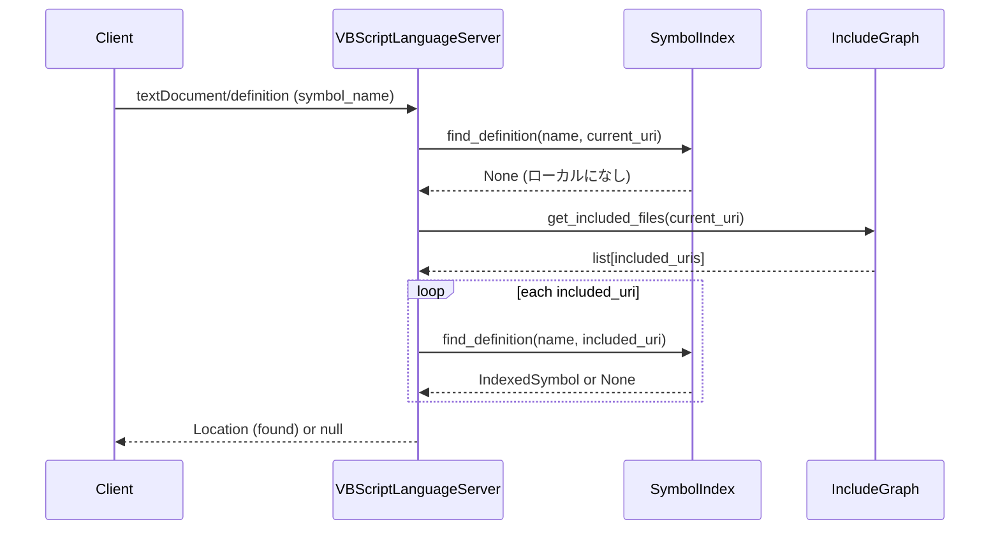
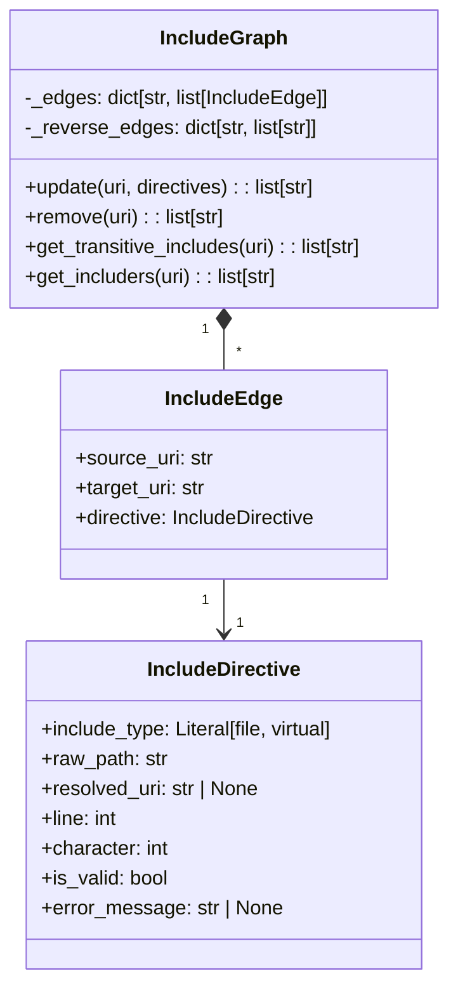

# Design Document

## Overview

**Purpose**: VBScript/ASP ファイル間のインクルードディレクティブを解析し、インクルードされたファイル内のシンボルへの Go to Definition / Find References を可能にする。

**Users**: VBScript/Classic ASP プロジェクトを扱う開発者が、インクルードファイルに定義されたシンボルへのナビゲーションに使用する。

**Impact**: 既存の VBScript LSP にインクルードグラフ管理機能を追加し、find_definition/find_references の検索範囲をインクルードファイルまで拡張する。

### Goals
- ASP インクルードディレクティブ（`file` / `virtual`）の検出とパス解決
- ファイル間インクルード関係の有向グラフ管理
- インクルードファイル内シンボルへの Go to Definition 対応
- インクルード元ファイルからの参照を Find References で検出

### Non-Goals
- 逆方向参照（インクルードされている側からインクルード元を検索）の UI 提供
- インクルード階層のビジュアライゼーション
- ワークスペース外ファイルの完全サポート
- IIS 設定ファイルからの仮想パスマッピング読み込み

## Architecture

### Existing Architecture Analysis

現在の VBScript LSP は以下の構成:

- **VBScriptLanguageServer** (`server.py`): pygls ベースの LSP サーバー、ドキュメントキャッシュ管理
- **SymbolIndex** (`index.py`): シンボルの URI/名前によるインデックス管理
- **ReferenceTracker** (`reference_tracker.py`): シンボル参照の追跡
- **VBScriptParser** (`parser.py`): VBScript/ASP コードからシンボル抽出
- **ASPScriptExtractor** (`asp_extractor.py`): ASP ファイルから VBScript ブロック抽出

インクルードディレクティブは現在未対応。ASPScriptExtractor は `<% %>` と `<script runat="server">` のみを処理している。

### Architecture Pattern & Boundary Map



**Architecture Integration**:
- Selected pattern: レイヤードアーキテクチャ（既存パターンを維持）
- Domain boundaries: パーサー層（構文解析） / インデックス層（検索最適化） / サーバー層（LSP プロトコル）
- Existing patterns preserved: SymbolIndex/ReferenceTracker の二重インデックス、パーサーの単一責任
- New components rationale: IncludeDirectiveParser（インクルード構文解析）、IncludeGraph（依存関係管理）
- Steering compliance: パッケージ分離、snake_case ファイル命名、dataclass によるデータモデル

### Technology Stack

| Layer | Choice / Version | Role in Feature | Notes |
|-------|------------------|-----------------|-------|
| Backend / Services | Python 3.11 | LSP サーバー実装 | 既存スタック維持 |
| Data / Storage | In-memory dict | インクルードグラフ保持 | ファイル永続化不要 |
| Infrastructure / Runtime | pygls | LSP プロトコルハンドリング | 既存依存 |

## System Flows

### インクルードグラフ構築フロー



### インクルード経由の定義検索フロー



## Requirements Traceability

| Requirement | Summary | Components | Interfaces | Flows |
|-------------|---------|------------|------------|-------|
| 1.1, 1.2, 1.3, 1.4 | インクルードディレクティブ解析 | IncludeDirectiveParser | extract_includes() | 構築フロー |
| 2.1, 2.2, 2.3, 2.4 | インクルードグラフ構築 | IncludeGraph | update(), get_transitive_includes() | 構築フロー |
| 3.1, 3.2, 3.3, 3.4 | インクルードファイル間定義検索 | VBScriptLanguageServer, SymbolIndex | goto_definition() | 定義検索フロー |
| 4.1, 4.2, 4.3, 4.4 | インクルードファイル間参照検索 | VBScriptLanguageServer, ReferenceTracker | find_references() | 類似フロー |
| 5.1, 5.2, 5.3 | インクルードシンボル情報 | VBScriptParser | document_symbol() | 構築フロー |
| 6.1, 6.2, 6.3, 6.4 | グラフ更新 | IncludeGraph | update(), remove() | 構築フロー |

## Components and Interfaces

| Component | Domain/Layer | Intent | Req Coverage | Key Dependencies | Contracts |
|-----------|--------------|--------|--------------|------------------|-----------|
| IncludeDirectiveParser | Parser | ASPインクルード構文解析 | 1.1-1.4 | re (P2) | Service |
| IncludeGraph | Index | ファイル間依存関係管理 | 2.1-2.4, 6.1-6.4 | IncludeDirectiveParser (P0) | Service, State |
| VBScriptLanguageServer | Server | LSP拡張（インクルード対応） | 3.1-3.4, 4.1-4.4, 5.1-5.3 | IncludeGraph (P0), SymbolIndex (P0) | API |

### Parser Layer

#### IncludeDirectiveParser

| Field | Detail |
|-------|--------|
| Intent | ASPファイルからインクルードディレクティブを抽出しパス解決する |
| Requirements | 1.1, 1.2, 1.3, 1.4 |

**Responsibilities & Constraints**
- `<!--#include file="...">` と `<!--#include virtual="...">` の検出
- 相対パス/仮想パスの解決
- ディレクティブ位置（行番号・文字位置）の記録

**Dependencies**
- Inbound: VBScriptLanguageServer — ASP ファイルオープン時に呼び出し (P0)
- External: re (標準ライブラリ) — 正規表現パターンマッチング (P2)

**Contracts**: Service [x]

##### Service Interface
```python
@dataclass
class IncludeDirective:
    """インクルードディレクティブの解析結果"""
    include_type: Literal["file", "virtual"]
    raw_path: str
    resolved_uri: str | None
    line: int
    character: int
    end_line: int
    end_character: int
    is_valid: bool
    error_message: str | None = None


class IncludeDirectiveParser:
    """ASP インクルードディレクティブパーサー"""

    def __init__(self, workspace_root: str | None = None) -> None:
        """
        Args:
            workspace_root: 仮想パス解決のためのルートディレクトリ
        """
        ...

    def extract_includes(
        self,
        content: str,
        source_uri: str,
    ) -> list[IncludeDirective]:
        """ASPコンテンツからインクルードディレクティブを抽出する

        Args:
            content: ASPファイルの内容
            source_uri: 解析元ファイルのURI

        Returns:
            検出されたインクルードディレクティブのリスト
        """
        ...
```

- Preconditions: content は有効な文字列、source_uri はファイル URI 形式
- Postconditions: 全ての `<!--#include ...-->` が解析され、パス解決が試みられる
- Invariants: is_valid=False の場合、error_message が設定される

**Implementation Notes**
- Integration: VBScriptLanguageServer._open_document() から呼び出し
- Validation: パス存在確認は IncludeGraph 側で実施（遅延検証）
- Risks: 仮想パスのルート設定がない場合の解決失敗

---

### Index Layer

#### IncludeGraph

| Field | Detail |
|-------|--------|
| Intent | ファイル間のインクルード関係を有向グラフとして管理し、推移的依存関係を提供する |
| Requirements | 2.1, 2.2, 2.3, 2.4, 6.1, 6.2, 6.3, 6.4 |

**Responsibilities & Constraints**
- URI をキーとしたインクルード関係の保持
- 推移閉包の計算（A→B→C なら A から C のシンボルにアクセス可能）
- 循環参照の検出と警告
- ファイル変更時のインクリメンタル更新

**Dependencies**
- Inbound: VBScriptLanguageServer — グラフ更新・クエリ (P0)
- Inbound: IncludeDirectiveParser — ディレクティブ情報提供 (P0)

**Contracts**: Service [x] / State [x]

##### Service Interface
```python
@dataclass
class IncludeEdge:
    """インクルード関係のエッジ"""
    source_uri: str
    target_uri: str
    directive: IncludeDirective


class IncludeGraph:
    """インクルードファイルの依存関係グラフ"""

    def update(
        self,
        uri: str,
        directives: list[IncludeDirective],
    ) -> list[str]:
        """指定URIのインクルード関係を更新する

        Args:
            uri: 更新対象ファイルのURI
            directives: 解析されたインクルードディレクティブ

        Returns:
            影響を受けるファイルURIのリスト（再インデックス対象）
        """
        ...

    def remove(self, uri: str) -> list[str]:
        """指定URIをグラフから削除する

        Args:
            uri: 削除対象ファイルのURI

        Returns:
            影響を受けるファイルURIのリスト
        """
        ...

    def get_direct_includes(self, uri: str) -> list[str]:
        """直接インクルードしているファイルのURIを取得する

        Args:
            uri: 対象ファイルのURI

        Returns:
            直接インクルードしているファイルのURIリスト
        """
        ...

    def get_transitive_includes(self, uri: str) -> list[str]:
        """推移的にインクルードしている全ファイルのURIを取得する

        循環参照がある場合はループを打ち切り、検出した循環をログ出力する。

        Args:
            uri: 対象ファイルのURI

        Returns:
            推移的にインクルードしている全ファイルのURIリスト（順序は依存順）
        """
        ...

    def get_includers(self, uri: str) -> list[str]:
        """指定URIをインクルードしているファイルのURIを取得する

        Args:
            uri: 対象ファイルのURI

        Returns:
            指定URIをインクルードしているファイルのURIリスト
        """
        ...

    def get_include_directives(self, uri: str) -> list[IncludeDirective]:
        """指定URIのインクルードディレクティブを取得する

        Document Symbols でインクルードシンボルを表示するために使用。

        Args:
            uri: 対象ファイルのURI

        Returns:
            インクルードディレクティブのリスト
        """
        ...

    def has_cycle(self, uri: str) -> bool:
        """指定URIから到達可能な循環参照があるかチェックする

        Args:
            uri: チェック開始ファイルのURI

        Returns:
            循環参照が存在する場合True
        """
        ...
```

- Preconditions: uri は有効なファイル URI 形式
- Postconditions: update 後、グラフは一貫性を保つ
- Invariants: 循環参照があっても無限ループにならない

##### State Management
- State model: `dict[str, list[IncludeEdge]]` 形式の隣接リスト（出力辺）、`dict[str, list[str]]` 形式の逆隣接リスト（入力辺）
- Persistence: メモリ内のみ（LSP セッション終了時に破棄）
- Concurrency strategy: 単一スレッド（pygls のイベントループ内で処理）

**Implementation Notes**
- Integration: VBScriptLanguageServer の document open/change/close イベントで更新
- Validation: get_transitive_includes で循環検出、ログ出力
- Risks: 大規模プロジェクトでの推移閉包計算コスト（キャッシュで軽減）

---

### Server Layer

#### VBScriptLanguageServer (拡張)

| Field | Detail |
|-------|--------|
| Intent | インクルードグラフを活用してファイル間シンボル検索を実現する |
| Requirements | 3.1, 3.2, 3.3, 3.4, 4.1, 4.2, 4.3, 4.4, 5.1, 5.2, 5.3 |

**Responsibilities & Constraints**
- IncludeGraph の管理（初期化・更新）
- goto_definition でインクルード先シンボルを検索
- find_references でインクルード元からの参照を統合
- document_symbol でインクルードディレクティブをシンボルとして返却

**Dependencies**
- Outbound: IncludeGraph — インクルード関係クエリ (P0)
- Outbound: SymbolIndex — シンボル検索 (P0)
- Outbound: IncludeDirectiveParser — ディレクティブ解析 (P0)

**Contracts**: API [x]

##### API Contract

既存 LSP ハンドラの拡張:

| Method | Endpoint | Request | Response | Errors |
|--------|----------|---------|----------|--------|
| textDocument/definition | (LSP) | DefinitionParams | Location / Location[] / null | - |
| textDocument/references | (LSP) | ReferenceParams | Location[] / null | - |
| textDocument/documentSymbol | (LSP) | DocumentSymbolParams | DocumentSymbol[] / null | - |

**Implementation Notes**
- Integration:
  - `_open_document`: IncludeDirectiveParser でディレクティブ抽出 → IncludeGraph 更新 → インクルード先ファイル読み込み
  - `goto_definition`: ローカル検索失敗時に IncludeGraph.get_transitive_includes() で取得した URI 群を検索
  - `find_references`: IncludeGraph.get_includers() で取得した URI 群からの参照を統合
  - `document_symbol`: IncludeGraph.get_include_directives() からインクルードシンボルを生成
- Validation: インクルード先ファイルがワークスペース外の場合はスキップ
- Risks: 大量のインクルードファイルがある場合の初期読み込み時間

## Data Models

### Domain Model



**Aggregates and Boundaries**:
- IncludeGraph が集約ルート、IncludeEdge/IncludeDirective は値オブジェクト
- IncludeDirective は不変（frozen=True）

**Business Rules**:
- 同一ファイルへの複数インクルードは許可（重複排除しない）
- 循環参照は警告するが、グラフには保持
- 解決不能パスは is_valid=False でグラフに保持（Document Symbols でエラー表示用）

### Logical Data Model

**Structure Definition**:
- IncludeGraph._edges: `dict[str, list[IncludeEdge]]` — source_uri → edges
- IncludeGraph._reverse_edges: `dict[str, list[str]]` — target_uri → source_uris
- 推移閉包キャッシュ: `dict[str, list[str]]` — uri → transitive_includes（オプション）

**Indexing Strategy**:
- 双方向インデックス（出力辺・入力辺）で O(1) アクセス
- 推移閉包はクエリ時に DFS で計算（小規模プロジェクトでは十分高速）

## Error Handling

### Error Strategy
- パス解決失敗: IncludeDirective.is_valid=False、error_message 設定、グラフには保持
- 循環参照検出: ログ出力（warning）、クエリ結果からは循環部分を除外
- ファイル読み込み失敗: ログ出力（warning）、シンボルインデックスには追加しない

### Error Categories and Responses
**User Errors** (Invalid Path): パス解決失敗 → Document Symbols でエラーマーカー付きインクルードシンボル表示
**System Errors** (File Access): ファイル読み込み失敗 → ログ出力、該当ファイルのシンボルは検索対象外
**Business Logic Errors** (Circular Include): 循環検出 → ログ警告、無限ループ防止

## Testing Strategy

### Unit Tests
- IncludeDirectiveParser: 各種インクルード構文のパース、パス解決
- IncludeGraph: グラフ更新、推移閉包計算、循環検出
- パス解決: 相対パス、仮想パス、存在しないパス

### Integration Tests
- VBScriptLanguageServer: インクルード経由の goto_definition
- VBScriptLanguageServer: インクルード元からの find_references
- Document Symbols: インクルードシンボルの表示

### E2E/UI Tests (if applicable)
- 複数ファイルを含む ASP プロジェクトでのナビゲーション
- 循環参照プロジェクトでの動作確認

## Performance & Scalability

**Target Metrics**:
- インクルードグラフ更新: < 10ms（単一ファイル変更時）
- 推移閉包計算: < 100ms（100ファイル規模）
- 初期読み込み: < 1s（100ファイル規模）

**Optimization Techniques**:
- 推移閉包の遅延計算とキャッシュ
- ファイル変更時のインクリメンタル更新（影響範囲のみ再計算）
- インクルード先ファイルの遅延読み込み（必要時にのみインデックス化）
