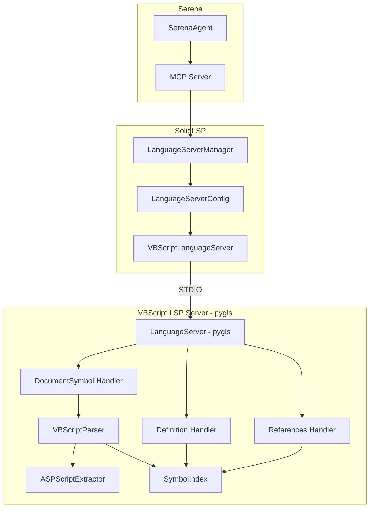
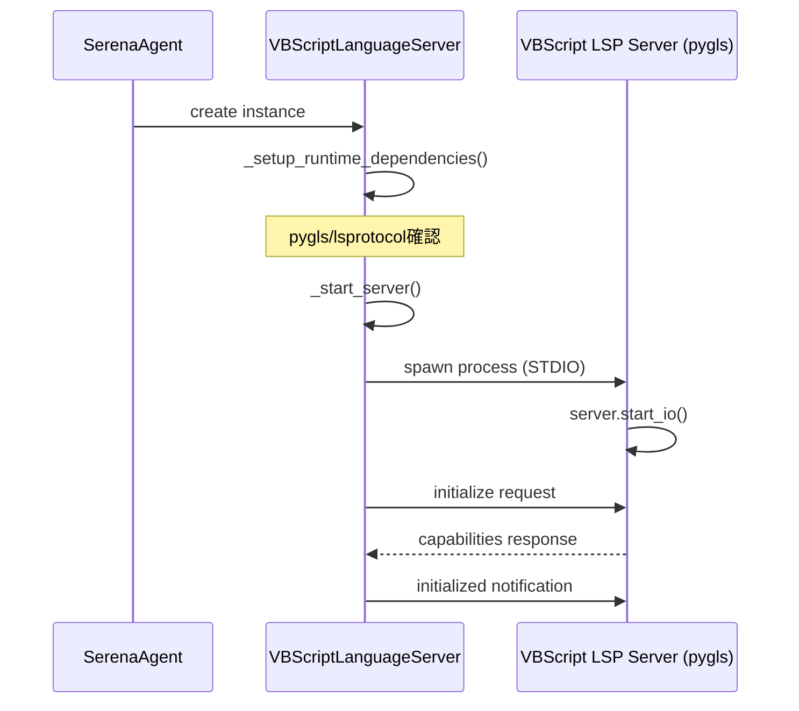
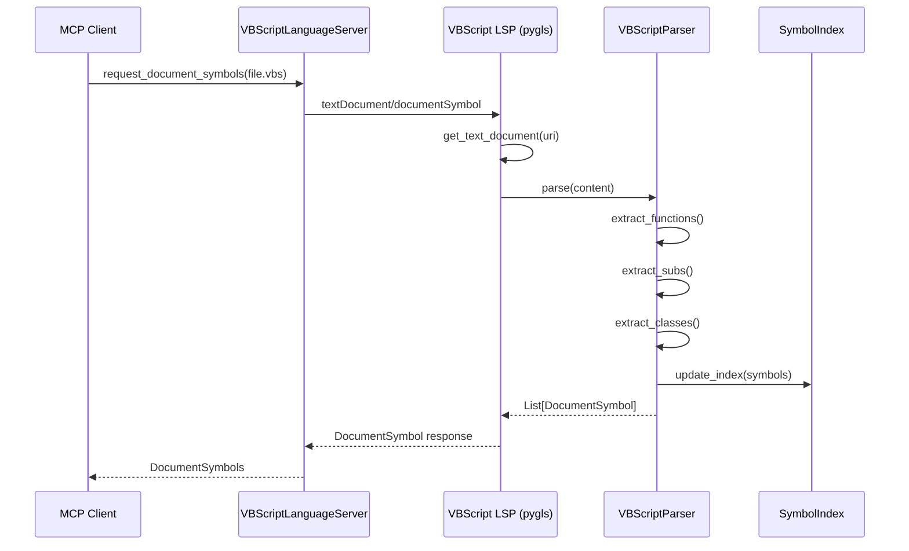
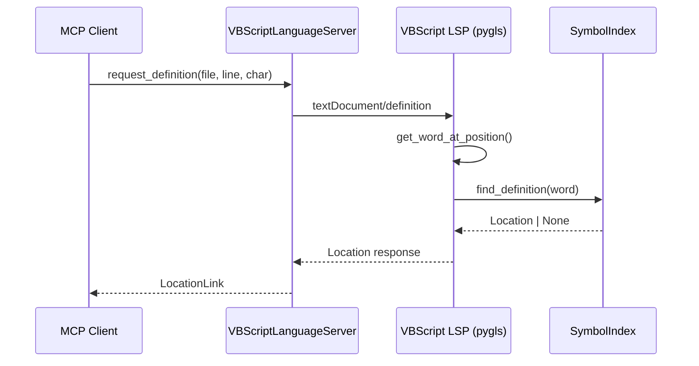
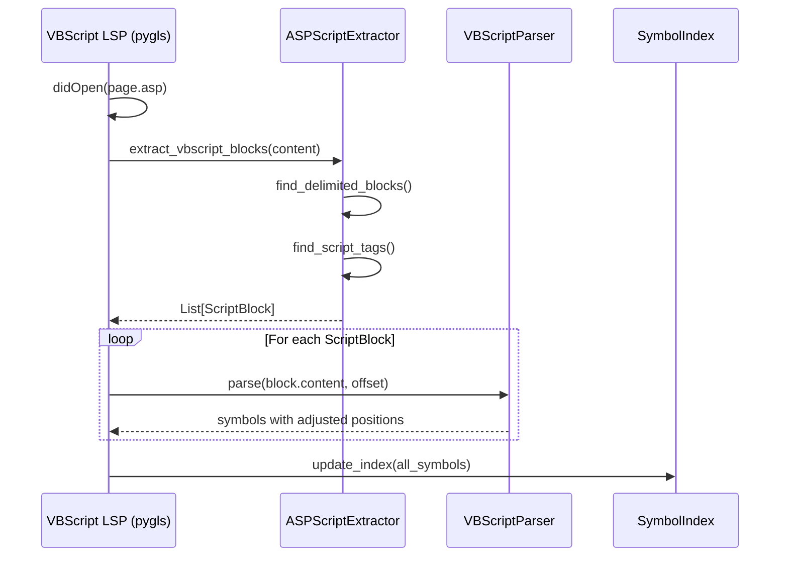

# Design Document: VBScript Language Support

## Overview

**Purpose**: 本機能はSerenaにVBScript言語サポートを追加し、レガシーVBScript/Classic ASPコードベースに対してセマンティックなコード解析・編集機能を提供する。

**Users**: VBScriptやClassic ASPで構築されたレガシーシステムの保守・移行を行う開発者が、シンボル検索、定義への移動、参照検索などのIDE機能を利用できるようになる。

**Impact**: 既存の`solidlsp`言語サーバーアーキテクチャを拡張し、新たに`VBSCRIPT`言語タイプを追加する。**pygls**フレームワークを使用して独自のLSPサーバーを構築し、標準LSPプロトコルに完全準拠した実装を行う。

### Goals
- SerenaでVBScriptファイル（.vbs, .asp, .inc）を認識し処理できるようにする
- **pygls**を使用して完全なLSPサーバーを独自構築する
- Function/Sub/Class/Propertyなどの主要シンボルを抽出できるようにする
- 標準LSPプロトコル（documentSymbol, definition, references）をサポートする
- 既存のSerena言語サーバーパターンとの整合性を維持する
- レガシーエンコーディング（Shift_JIS等）に対応する

### Non-Goals
- 構文エラー検出・診断機能（将来の拡張として検討）
- コード補完機能（将来の拡張として検討）
- VBScript以外のASP内言語（JScript等）のサポート

## Architecture

### Existing Architecture Analysis

現在のSerena言語サーバーアーキテクチャは以下のパターンに従う：

- **`SolidLanguageServer`**: 全言語サーバーの基底クラス。LSPプロトコルハンドリング、ファイルバッファ管理、シンボルキャッシュを提供
- **`Language` enum**: サポート言語を列挙。`get_source_fn_matcher()`と`get_ls_class()`で言語固有の設定を返す
- **言語サーバー実装クラス**: `BashLanguageServer`等、各言語は`SolidLanguageServer`を継承し、外部LSPプロセスを起動して通信
- **外部プロセス起動**: `ProcessLaunchInfo`で外部LSPプロセスを起動、STDIO経由で通信

### Architecture Pattern & Boundary Map



**Architecture Integration**:
- **Selected pattern**: pygls上に完全なLSPサーバーを構築し、既存の`SolidLanguageServer`から外部プロセスとして起動
- **Domain boundaries**:
  - **VBScriptLanguageServer** (Serena側): 外部LSPプロセスの起動・管理
  - **VBScript LSP Server** (pygls): シンボル解析、定義/参照検索の実装
- **Existing patterns preserved**: Language enum登録、ProcessLaunchInfo、STDIO通信パターン
- **New components rationale**:
  - **pygls LanguageServer**: 標準LSPプロトコルの基盤
  - **VBScriptParser**: VBScript構文解析
  - **ASPScriptExtractor**: ASPファイル内のVBScriptブロック抽出
  - **SymbolIndex**: シンボル情報のインデックス管理
- **Steering compliance**: パッケージ中心の構成、snake_case命名規則を維持

### Technology Stack

| Layer | Choice / Version | Role in Feature | Notes |
|-------|------------------|-----------------|-------|
| LSP Framework | pygls v2.0.0 | LSPサーバー基盤 | 新規依存関係 |
| LSP Types | lsprotocol | LSP型定義 | pygls依存関係 |
| Backend | Python 3.11 | 言語サーバー実装 | プロジェクト要件に準拠 |
| Parser | 正規表現（re module） | VBScript構文解析 | 外部依存なし、case-insensitive |
| Framework | SolidLSP | Serena統合基盤 | 既存パターンを活用 |
| Testing | pytest + syrupy | テスト実行・スナップショット | 既存テストパターン踏襲 |

## System Flows

### LSPサーバー起動フロー



### シンボル抽出フロー



### 定義への移動フロー



### ASPファイル解析フロー



## Requirements Traceability

| Requirement | Summary | Components | Interfaces | Flows |
|-------------|---------|------------|------------|-------|
| 1.1 | .vbs/.asp/.inc拡張子認識 | LanguageServerConfig | FilenameMatcher | - |
| 1.2 | VBScript自動検出 | Language enum | - | - |
| 1.3 | VBSCRIPT enum登録 | ls_config.py | Language.VBSCRIPT | - |
| 1.4 | VBScript LSクラス起動 | ls_config.py | get_ls_class() | - |
| 2.1 | SolidLanguageServer継承 | VBScriptLanguageServer | - | - |
| 2.2 | LSPプロセス起動 | VBScriptLanguageServer | ProcessLaunchInfo | LSP起動フロー |
| 2.3 | documentSymbolサポート | DocumentSymbol Handler | @server.feature | シンボル抽出フロー |
| 2.4 | definitionサポート | Definition Handler | @server.feature | 定義移動フロー |
| 2.5 | referencesサポート | References Handler | @server.feature | - |
| 2.6 | エラーメッセージ表示 | VBScriptLanguageServer | - | - |
| 3.1 | 依存関係定義 | pyproject.toml | pygls, lsprotocol | - |
| 3.2 | 依存関係チェック | VBScriptLanguageServer | _setup_runtime_dependencies() | LSP起動フロー |
| 3.3-3.5 | 自動インストール/進捗/プラットフォーム | RuntimeDependencyCollection | - | - |
| 4.1 | 除外ディレクトリ | VBScriptLanguageServer | is_ignored_dirname() | - |
| 4.2 | ASP埋め込み対応 | ASPScriptExtractor | extract() | ASP解析フロー |
| 4.3 | エンコーディング設定 | VBScriptLanguageServer | - | - |
| 4.4 | プロジェクト設定適用 | LanguageServerConfig | - | - |
| 5.1-5.4 | テスト/ドキュメント | test/ | pytest markers | - |

## Components and Interfaces

| Component | Domain/Layer | Intent | Req Coverage | Key Dependencies | Contracts |
|-----------|--------------|--------|--------------|------------------|-----------|
| VBScriptLanguageServer | SolidLSP | Serena側LSPラッパー | 1.4, 2.1, 2.2, 2.6, 3.1-3.5, 4.1, 4.3 | SolidLanguageServer (P0) | Service |
| VBScriptLSPServer | vbscript_lsp | pygls LSPサーバー本体 | 2.3, 2.4, 2.5 | pygls (P0) | LSP |
| VBScriptParser | vbscript_lsp | VBScript構文解析 | 2.3 | re module (P0) | Service |
| ASPScriptExtractor | vbscript_lsp | ASPからVBScript抽出 | 4.2 | - | Service |
| SymbolIndex | vbscript_lsp | シンボルインデックス | 2.4, 2.5 | - | Service |
| Language.VBSCRIPT | SolidLSP/Config | 言語enum登録 | 1.2, 1.3 | - | - |

### SolidLSP Layer

#### VBScriptLanguageServer

| Field | Detail |
|-------|--------|
| Intent | Serena側でVBScript LSPプロセスを管理し、SolidLanguageServerインターフェースを提供 |
| Requirements | 1.4, 2.1, 2.2, 2.6, 3.1-3.5, 4.1, 4.3 |

**Responsibilities & Constraints**
- pygls LSPサーバープロセスの起動と管理
- STDIO通信による外部LSPとのやり取り
- 既存のSolidLanguageServerパターンとの互換性維持

**Dependencies**
- Inbound: SerenaAgent/MCP — シンボル検索リクエスト (P0)
- Outbound: VBScriptLSPServer — LSPリクエスト転送 (P0)
- External: SolidLanguageServer base class — 基盤機能 (P0)

**Contracts**: Service [x]

##### Service Interface

```python
class VBScriptLanguageServer(SolidLanguageServer):
    """VBScript言語サーバー（Serena側ラッパー）"""

    def __init__(
        self,
        config: LanguageServerConfig,
        repository_root_path: str,
        solidlsp_settings: SolidLSPSettings
    ) -> None:
        """インスタンス初期化。pyglsサーバーを起動"""
        ...

    @classmethod
    def _setup_runtime_dependencies(
        cls,
        config: LanguageServerConfig,
        solidlsp_settings: SolidLSPSettings
    ) -> str:
        """pygls/lsprotocolの依存関係を確認し、起動コマンドを返す"""
        ...

    def is_ignored_dirname(self, dirname: str) -> bool:
        """VBScript固有の除外ディレクトリ判定"""
        ...

    @staticmethod
    def _get_initialize_params(repository_absolute_path: str) -> InitializeParams:
        """LSP初期化パラメータを返す"""
        ...

    def _start_server(self) -> None:
        """pyglsサーバープロセスを起動"""
        ...
```

- Preconditions: pygls, lsprotocolパッケージがインストール済み
- Postconditions: LSPサーバープロセスが起動し、通信可能な状態
- Invariants: プロセスは親プロセス終了時に適切にクリーンアップされる

**Implementation Notes**
- Integration: `python -m solidlsp.language_servers.vbscript_lsp.server` で起動
- Validation: 起動前にpygls/lsprotocolの存在を確認
- Risks: プロセス管理の複雑さ

---

### VBScript LSP Layer (pygls)

#### VBScriptLSPServer

| Field | Detail |
|-------|--------|
| Intent | pygls上に構築された完全なVBScript LSPサーバー |
| Requirements | 2.3, 2.4, 2.5 |

**Responsibilities & Constraints**
- 標準LSPプロトコルの実装（documentSymbol, definition, references）
- ドキュメント管理とシンボルインデックスの維持
- STDIO経由でのクライアント通信

**Dependencies**
- Inbound: VBScriptLanguageServer — LSPリクエスト (P0)
- Outbound: VBScriptParser — 構文解析 (P0)
- Outbound: SymbolIndex — シンボル検索 (P0)
- External: pygls — LSPフレームワーク (P0)

**Contracts**: LSP [x]

##### LSP Interface

```python
from lsprotocol import types
from pygls.lsp.server import LanguageServer

# サーバーインスタンス
server = LanguageServer("vbscript-lsp", "v1.0.0")

@server.feature(types.TEXT_DOCUMENT_DID_OPEN)
def did_open(ls: LanguageServer, params: types.DidOpenTextDocumentParams) -> None:
    """ドキュメントを開いた時の処理"""
    ...

@server.feature(types.TEXT_DOCUMENT_DID_CHANGE)
def did_change(ls: LanguageServer, params: types.DidChangeTextDocumentParams) -> None:
    """ドキュメント変更時の処理"""
    ...

@server.feature(types.TEXT_DOCUMENT_DOCUMENT_SYMBOL)
def document_symbol(
    ls: LanguageServer,
    params: types.DocumentSymbolParams
) -> list[types.DocumentSymbol] | None:
    """ドキュメント内のシンボル一覧を返す"""
    ...

@server.feature(types.TEXT_DOCUMENT_DEFINITION)
def goto_definition(
    ls: LanguageServer,
    params: types.DefinitionParams
) -> types.Location | list[types.Location] | None:
    """シンボルの定義位置を返す"""
    ...

@server.feature(types.TEXT_DOCUMENT_REFERENCES)
def find_references(
    ls: LanguageServer,
    params: types.ReferenceParams
) -> list[types.Location] | None:
    """シンボルの参照位置一覧を返す"""
    ...

def main() -> None:
    """エントリーポイント: STDIOモードでサーバー起動"""
    server.start_io()
```

- Preconditions: 有効なLSP初期化リクエストを受信済み
- Postconditions: LSP仕様に準拠したレスポンスを返す
- Invariants: シンボルインデックスはドキュメント変更時に自動更新

---

#### VBScriptParser

| Field | Detail |
|-------|--------|
| Intent | VBScriptソースコードから関数・クラス等のシンボルを抽出 |
| Requirements | 2.3 |

**Responsibilities & Constraints**
- 正規表現ベースのVBScript構文解析
- Function/Sub/Class/Propertyの検出
- 行番号・カラム位置の正確な算出

**Dependencies**
- Inbound: VBScriptLSPServer — 解析リクエスト (P0)
- Outbound: ASPScriptExtractor — ASPブロック抽出 (P1)
- External: Python re module — 正規表現エンジン (P0)

**Contracts**: Service [x]

##### Service Interface

```python
from dataclasses import dataclass, field
from lsprotocol import types

@dataclass
class ParsedSymbol:
    """解析されたシンボル情報"""
    name: str
    kind: types.SymbolKind
    range: types.Range
    selection_range: types.Range
    children: list["ParsedSymbol"] = field(default_factory=list)

    def to_document_symbol(self) -> types.DocumentSymbol:
        """LSP DocumentSymbol形式に変換"""
        ...


class VBScriptParser:
    """VBScript構文パーサー"""

    def __init__(self) -> None:
        self._asp_extractor = ASPScriptExtractor()

    def parse(
        self,
        content: str,
        uri: str,
        line_offset: int = 0
    ) -> list[ParsedSymbol]:
        """ソースコードからシンボルを抽出

        Args:
            content: VBScript/ASPソースコード
            uri: ドキュメントURI
            line_offset: 行番号オフセット（ASPブロック用）

        Returns:
            抽出されたシンボルのリスト
        """
        ...

    def parse_vbscript(self, content: str, line_offset: int = 0) -> list[ParsedSymbol]:
        """純粋なVBScriptコードを解析"""
        ...

    def parse_asp(self, content: str) -> list[ParsedSymbol]:
        """ASPファイルを解析（VBScriptブロックを抽出して解析）"""
        ...

    def _extract_functions(self, content: str, offset: int) -> list[ParsedSymbol]:
        """Function定義を抽出"""
        ...

    def _extract_subs(self, content: str, offset: int) -> list[ParsedSymbol]:
        """Sub定義を抽出"""
        ...

    def _extract_classes(self, content: str, offset: int) -> list[ParsedSymbol]:
        """Class定義を抽出（内部のメンバーも再帰的に抽出）"""
        ...

    def _extract_properties(self, content: str, offset: int) -> list[ParsedSymbol]:
        """Property定義を抽出"""
        ...
```

- Preconditions: `content`は有効なVBScriptコード（部分的でも可）
- Postconditions: 各シンボルの位置情報は0-indexed
- Invariants: 解析は大文字小文字を区別しない（case-insensitive）

---

#### ASPScriptExtractor

| Field | Detail |
|-------|--------|
| Intent | ASPファイルからVBScriptブロックを抽出 |
| Requirements | 4.2 |

**Responsibilities & Constraints**
- `<% %>` ブロックの検出と抽出
- `<script runat="server">` ブロックの検出と抽出
- 各ブロックの開始行番号の算出

**Dependencies**
- Inbound: VBScriptParser — 抽出リクエスト (P0)
- External: Python re module — 正規表現エンジン (P0)

**Contracts**: Service [x]

##### Service Interface

```python
@dataclass
class ScriptBlock:
    """ASPファイル内のスクリプトブロック"""
    content: str
    start_line: int
    start_character: int
    end_line: int
    end_character: int
    is_inline: bool  # <%= %> の場合True


class ASPScriptExtractor:
    """ASPファイルからVBScriptブロックを抽出"""

    def extract(self, content: str) -> list[ScriptBlock]:
        """ASPファイルからVBScriptブロックを抽出"""
        ...

    def _find_delimited_blocks(self, content: str) -> list[ScriptBlock]:
        """<% %> ブロックを検出"""
        ...

    def _find_script_tags(self, content: str) -> list[ScriptBlock]:
        """<script runat="server"> ブロックを検出"""
        ...

    def _calculate_position(self, content: str, char_offset: int) -> tuple[int, int]:
        """文字オフセットから行番号・カラムを計算"""
        ...
```

---

#### SymbolIndex

| Field | Detail |
|-------|--------|
| Intent | ワークスペース全体のシンボル情報を管理し、高速な検索を提供 |
| Requirements | 2.4, 2.5 |

**Responsibilities & Constraints**
- ドキュメントごとのシンボル情報を保持
- 名前による定義検索
- 参照位置の検索

**Dependencies**
- Inbound: VBScriptLSPServer — インデックス更新/検索 (P0)

**Contracts**: Service [x]

##### Service Interface

```python
from lsprotocol import types

@dataclass
class IndexedSymbol:
    """インデックス化されたシンボル"""
    name: str
    kind: types.SymbolKind
    uri: str
    range: types.Range
    container_name: str | None = None


class SymbolIndex:
    """シンボルインデックス"""

    def __init__(self) -> None:
        self._symbols_by_uri: dict[str, list[IndexedSymbol]] = {}
        self._symbols_by_name: dict[str, list[IndexedSymbol]] = {}

    def update(self, uri: str, symbols: list[ParsedSymbol]) -> None:
        """ドキュメントのシンボル情報を更新"""
        ...

    def remove(self, uri: str) -> None:
        """ドキュメントのシンボル情報を削除"""
        ...

    def find_definition(self, name: str) -> IndexedSymbol | None:
        """名前から定義を検索"""
        ...

    def find_references(
        self,
        name: str,
        include_declaration: bool = False
    ) -> list[types.Location]:
        """名前から参照位置を検索"""
        ...

    def get_symbols_in_document(self, uri: str) -> list[IndexedSymbol]:
        """ドキュメント内のシンボル一覧を取得"""
        ...
```

---

### Configuration Layer

#### Language Enum Extension

`ls_config.py`への追加：

```python
class Language(str, Enum):
    # ... existing entries ...
    VBSCRIPT = "vbscript"
    """VBScript language server for .vbs, .asp, and .inc files"""
```

#### FilenameMatcher Extension

```python
def get_source_fn_matcher(self) -> FilenameMatcher:
    match self:
        # ... existing cases ...
        case self.VBSCRIPT:
            return FilenameMatcher("*.vbs", "*.asp", "*.inc")
```

#### LanguageServer Class Mapping

```python
def get_ls_class(self) -> type["SolidLanguageServer"]:
    match self:
        # ... existing cases ...
        case self.VBSCRIPT:
            from solidlsp.language_servers.vbscript_language_server import VBScriptLanguageServer
            return VBScriptLanguageServer
```

#### 依存関係追加

`pyproject.toml`への追加：

```toml
[project.dependencies]
# ... existing dependencies ...
pygls = "^2.0.0"
lsprotocol = "^2024.0.0"
```

## Data Models

### Domain Model

#### ParsedSymbol

```python
@dataclass
class ParsedSymbol:
    name: str
    kind: types.SymbolKind
    range: types.Range
    selection_range: types.Range
    children: list["ParsedSymbol"] = field(default_factory=list)
```

**LSP SymbolKind Mapping**:
| VBScript Construct | SymbolKind | Notes |
|-------------------|------------|-------|
| Function | Function (12) | - |
| Sub | Function (12) | LSPにSubはないためFunctionで代用 |
| Class | Class (5) | - |
| Property Get/Let/Set | Property (7) | - |
| Const | Constant (14) | Phase 2 |
| Dim (module level) | Variable (13) | Phase 2 |

#### ScriptBlock

```python
@dataclass
class ScriptBlock:
    content: str
    start_line: int
    start_character: int
    end_line: int
    end_character: int
    is_inline: bool
```

#### IndexedSymbol

```python
@dataclass
class IndexedSymbol:
    name: str
    kind: types.SymbolKind
    uri: str
    range: types.Range
    container_name: str | None = None
```

## Error Handling

### Error Strategy

LSPサーバーはクライアントとの通信でエラーが発生した場合、適切なLSPエラーレスポンスを返す。

### Error Categories and Responses

**Parse Errors**:
- 不正なVBScript構文 → 可能な限り解析を続行、検出できたシンボルのみ返す
- ASPブロック検出失敗 → 空のシンボルリストを返す

**System Errors**:
- エンコーディングエラー → フォールバックエンコーディング（UTF-8）で再試行
- ファイル読み込みエラー → LSPエラーレスポンスを返す

**LSP Protocol Errors**:
- 無効なリクエスト → `InvalidRequest` エラーコードを返す
- 未サポートメソッド → `MethodNotFound` エラーコードを返す

### Monitoring

- `logging`モジュールによるエラー・警告ログ
- LSPサーバー側のログはstderr経由でクライアントに転送可能

## Testing Strategy

### Unit Tests
- `VBScriptParser`: 各シンボル種別の抽出テスト
- `ASPScriptExtractor`: 各ブロック形式の抽出テスト
- `SymbolIndex`: インデックス更新・検索テスト
- 行番号オフセット計算テスト

### Integration Tests
- LSPサーバー起動・初期化テスト
- `textDocument/documentSymbol` エンドツーエンドテスト
- `textDocument/definition` エンドツーエンドテスト
- `textDocument/references` エンドツーエンドテスト

### Test Repository

`test/resources/repos/vbscript/test_repo/`に以下のテストケースを配置：

```
test_repo/
├── .serena/
│   └── config.yaml
├── simple.vbs          # 基本的なFunction/Sub
├── classes.vbs         # Class定義
├── properties.vbs      # Property Get/Let/Set
├── page.asp            # ASP埋め込み
├── include.inc         # インクルードファイル
└── encoding/
    └── shiftjis.vbs    # Shift_JISエンコーディング
```

### pytest Markers

`pyproject.toml`に追加：
```toml
markers = [
  # ... existing markers ...
  "vbscript: language server running for VBScript",
]
```

## File Structure

```
src/solidlsp/language_servers/
├── vbscript_language_server.py     # Serena側ラッパー
└── vbscript_lsp/
    ├── __init__.py
    ├── __main__.py                 # エントリーポイント
    ├── server.py                   # pygls LSPサーバー
    ├── parser.py                   # VBScriptParser
    ├── asp_extractor.py            # ASPScriptExtractor
    └── index.py                    # SymbolIndex
```

## Supporting References

### VBScript構文パターン（正規表現）

```python
import re

# Function定義
FUNCTION_PATTERN = re.compile(
    r"^\s*(public\s+|private\s+)?\s*function\s+(\w+)\s*\(([^)]*)\)",
    re.IGNORECASE | re.MULTILINE
)

# Sub定義
SUB_PATTERN = re.compile(
    r"^\s*(public\s+|private\s+)?\s*sub\s+(\w+)\s*\(([^)]*)\)",
    re.IGNORECASE | re.MULTILINE
)

# Class定義
CLASS_PATTERN = re.compile(
    r"^\s*class\s+(\w+)",
    re.IGNORECASE | re.MULTILINE
)

# End Class
END_CLASS_PATTERN = re.compile(
    r"^\s*end\s+class",
    re.IGNORECASE | re.MULTILINE
)

# Property定義
PROPERTY_PATTERN = re.compile(
    r"^\s*(public\s+|private\s+)?\s*property\s+(get|let|set)\s+(\w+)\s*\(([^)]*)\)",
    re.IGNORECASE | re.MULTILINE
)

# ASPブロック
ASP_BLOCK_PATTERN = re.compile(
    r"<%(?!=)(.*?)%>",
    re.DOTALL
)

# ASP出力式（シンボル抽出対象外）
ASP_INLINE_PATTERN = re.compile(
    r"<%=(.*?)%>",
    re.DOTALL
)

# script runat="server"
ASP_SCRIPT_TAG_PATTERN = re.compile(
    r'<script\s+[^>]*runat\s*=\s*["\']server["\'][^>]*>(.*?)</script>',
    re.IGNORECASE | re.DOTALL
)
```

詳細な調査ログと設計判断の背景は`research.md`を参照。
