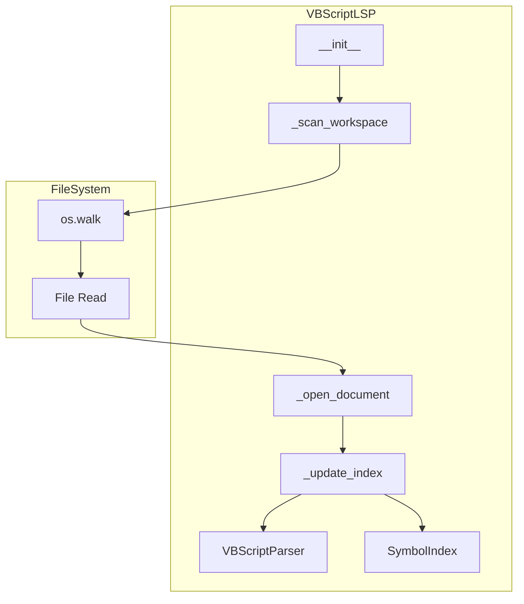
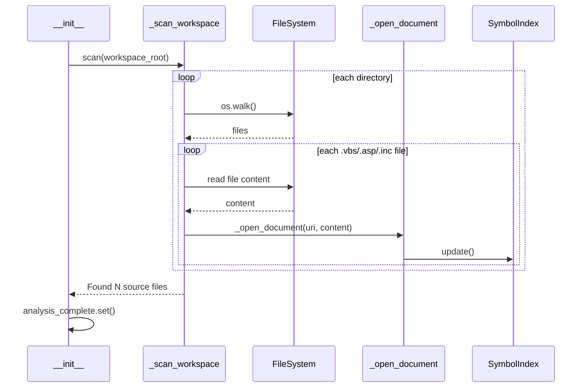

# Design Document: workspace-initial-scan

## Overview

**Purpose**: VBScript LSPサーバー起動時にワークスペース内の全VBScript関連ファイルを自動スキャンし、シンボルインデックスを構築することで、プロジェクト全体のシンボル検索を可能にする。

**Users**: VBScript/ASP開発者がSerena経由でコード解析を行う際、ファイルを個別に開くことなくプロジェクト全体のシンボル検索・定義ジャンプ・参照検索が利用可能になる。

**Impact**: 現在の「開いたファイルのみ」のインデックス方式から「プロジェクト全体」のインデックス方式に変更し、Python/TypeScript等の他言語サーバーと同等の機能レベルを実現する。

### Goals
- サーバー起動時に全VBScript関連ファイル（.vbs, .asp, .inc）を自動スキャン
- 未オープンファイルのシンボルも検索可能に
- Pyrightパターンに準拠した実装で一貫性を確保
- 100ファイル規模のプロジェクトを5秒以内にスキャン完了

### Non-Goals
- 非同期スキャン（将来的な拡張として検討）
- ファイル変更の自動監視（REQ-4として別途対応）
- workspace/symbol LSPリクエスト対応（REQ-2として別途対応）
- Shift-JIS自動検出（エラー時はreplaceで対応）

## Architecture

### Existing Architecture Analysis

**現在のドキュメント処理フロー**:
```
クライアントからファイルオープン
    ↓
_open_document(uri, content)
    ↓
_update_index() → SymbolIndex.update()
_update_includes() → IncludeGraph.update()
```

**既存コンポーネント**:
- `VBScriptLanguageServer` (server.py): pyglsベースのLSPサーバー
- `SymbolIndex` (index.py): シンボルインデックス管理
- `VBScriptParser` (parser.py): VBScriptパーサー
- `IncludeGraph` (include_graph.py): include追跡

### Architecture Pattern & Boundary Map



**Architecture Integration**:
- **Selected pattern**: Pyrightパターン（同期スキャン + threading.Event完了通知）
- **Domain boundaries**: server.py内に閉じた変更、SymbolIndex/Parserは既存のまま
- **Existing patterns preserved**: `_open_document()`による統一的なインデックス登録
- **New components rationale**: `_scan_workspace()`メソッドのみ追加、新クラスは不要
- **Steering compliance**: Language Server Patternに準拠

### Technology Stack

| Layer | Choice / Version | Role in Feature | Notes |
|-------|------------------|-----------------|-------|
| Backend | Python 3.11 | スキャン実装 | 既存要件 |
| Framework | pygls | LSPサーバー | 既存使用 |
| File I/O | pathlib, os.walk | ファイル走査 | 標準ライブラリ |
| Concurrency | threading.Event | 完了通知 | Pyrightパターン |

## System Flows

### ワークスペーススキャンフロー



**Key Decisions**:
- スキャンは`__init__`内で同期実行（LSPリクエスト受付前に完了必要）
- 既存の`_open_document()`を再利用してインデックス登録
- エラー発生時は警告ログを出力して継続

## Requirements Traceability

| Requirement | Summary | Components | Interfaces | Flows |
|-------------|---------|------------|------------|-------|
| 1.1 | ワークスペース再帰探索 | _scan_workspace | - | スキャンフロー |
| 1.2 | 拡張子フィルタリング | _scan_workspace | VBSCRIPT_EXTENSIONS | - |
| 1.3, 1.4 | 除外ディレクトリ | _scan_workspace | IGNORED_DIRS | - |
| 2.1, 2.2 | ファイル読み込み・パース | _scan_workspace, _open_document | - | スキャンフロー |
| 2.3, 2.4 | エラーハンドリング | _scan_workspace | - | - |
| 3.1 | ログ出力 | _scan_workspace | logger | - |
| 3.2 | 完了フラグ | VBScriptLanguageServer | analysis_complete | - |
| 3.3 | DEBUGログ | _scan_workspace | logger | - |
| 4.1, 4.2, 4.3 | 既存機能統合 | SymbolIndex | 既存IF | - |
| 5.1 | パフォーマンス | _scan_workspace | - | - |
| 5.2 | ブロッキング実行 | __init__ | - | スキャンフロー |
| 5.3 | 大規模警告 | _scan_workspace | logger | - |

## Components and Interfaces

| Component | Domain/Layer | Intent | Req Coverage | Key Dependencies | Contracts |
|-----------|--------------|--------|--------------|------------------|-----------|
| VBScriptLanguageServer | LSP Server | ワークスペーススキャン追加 | 1.1-5.3 | SymbolIndex (P0), VBScriptParser (P0) | State |
| _scan_workspace | LSP Server | ファイル走査・登録 | 1.1-3.3, 5.1-5.3 | _open_document (P0) | - |

### LSP Server Layer

#### VBScriptLanguageServer (拡張)

| Field | Detail |
|-------|--------|
| Intent | ワークスペース初期スキャン機能を追加 |
| Requirements | 1.1-5.3 |

**Responsibilities & Constraints**
- 起動時にワークスペース内の全VBScript関連ファイルをスキャン
- スキャン完了後にanalysis_completeイベントをセット
- エラー発生時も処理を継続（個別ファイルエラーはログのみ）

**Dependencies**
- Inbound: pygls LanguageServer — LSPプロトコル処理 (P0)
- Internal: _open_document — インデックス登録 (P0)
- Internal: VBScriptParser — シンボル抽出 (P0)
- Internal: SymbolIndex — シンボル格納 (P0)

**Contracts**: State [x]

##### State Management

**追加属性**:
```python
# 完了通知イベント
analysis_complete: threading.Event

# 定数
VBSCRIPT_EXTENSIONS: frozenset[str] = frozenset({'.vbs', '.asp', '.inc'})
IGNORED_DIRS: frozenset[str] = frozenset({'.git', 'node_modules', 'Backup', 'bin', 'obj'})
LARGE_PROJECT_THRESHOLD: int = 1000
```

**状態遷移**:
- 初期状態: `analysis_complete`未セット
- スキャン完了後: `analysis_complete.set()`

##### Service Interface

```python
def _scan_workspace(self, root_path: str) -> int:
    """ワークスペース内の全VBScript関連ファイルをスキャン

    Args:
        root_path: ワークスペースルートパス

    Returns:
        スキャンしたファイル数

    Raises:
        なし（エラーはログ出力して継続）
    """
    ...

def _read_file_content(self, file_path: str) -> str | None:
    """ファイル内容を読み込み

    Args:
        file_path: ファイルパス

    Returns:
        ファイル内容、読み込み失敗時はNone
    """
    ...

def _is_target_file(self, filename: str) -> bool:
    """スキャン対象ファイルか判定

    Args:
        filename: ファイル名

    Returns:
        対象ファイルならTrue
    """
    ...

def _should_skip_directory(self, dirname: str) -> bool:
    """スキップすべきディレクトリか判定

    Args:
        dirname: ディレクトリ名

    Returns:
        スキップすべきならTrue
    """
    ...
```

- Preconditions: `root_path`が有効なディレクトリパス
- Postconditions: 全対象ファイルがSymbolIndexに登録、`analysis_complete`がセット
- Invariants: スキャン中もSymbolIndexは一貫した状態を維持

**Implementation Notes**
- Integration: `__init__`の最後で`_scan_workspace()`を呼び出し
- Validation: ファイル読み込みエラーは警告ログを出力して継続
- Risks: 大規模プロジェクトでの起動時間増加（警告ログで対応）

## Data Models

### Domain Model

本機能はデータモデルの変更を伴わない。既存のSymbolIndexとIncludeGraphをそのまま使用する。

**既存データ構造（変更なし）**:
- `IndexedSymbol`: シンボル情報（名前、種類、位置）
- `ParsedSymbol`: パース結果
- `IncludeDirective`: include情報

## Error Handling

### Error Strategy

ワークスペーススキャンは「ベストエフォート」方式を採用。個別ファイルのエラーでスキャン全体を停止せず、可能な限り多くのファイルをインデックス化する。

### Error Categories and Responses

| エラー種別 | 原因 | 対応 | ログレベル |
|-----------|------|------|-----------|
| FileNotFoundError | ファイルが存在しない | スキップして継続 | WARNING |
| PermissionError | 読み取り権限なし | スキップして継続 | WARNING |
| UnicodeDecodeError | エンコーディングエラー | `errors='replace'`で読み込み | DEBUG |
| パースエラー | VBScript構文エラー | スキップして継続（既存処理） | WARNING |

### Monitoring

- INFO: スキャン開始・完了（`Found N source files`）
- WARNING: 個別ファイルエラー
- DEBUG: 個別ファイル処理状況
- WARNING: 大規模プロジェクト警告（1000ファイル超）

## Testing Strategy

### Unit Tests
- `_is_target_file()`: 各拡張子の判定（.vbs, .VBS, .asp, .ASP, .inc, .INC）
- `_should_skip_directory()`: 除外ディレクトリ判定（.git, node_modules等）
- `_read_file_content()`: 正常読み込み、権限エラー、エンコーディングエラー

### Integration Tests
- `_scan_workspace()`: 既存テストリポジトリ（5ファイル）でのスキャン
- 空ディレクトリでのスキャン
- ネストしたディレクトリ構造でのスキャン
- 除外ディレクトリを含む構造でのスキャン

### E2E Tests
- サーバー起動後の`find_definition`（初期スキャンファイルのシンボル）
- サーバー起動後の`find_references`（プロジェクト全体検索）
- ファイルオープン時の既存インデックス更新

## Performance & Scalability

### Target Metrics
- 100ファイル規模: 5秒以内
- スキャン速度: 20ファイル/秒以上

### Monitoring Points
- スキャン完了時間
- 処理ファイル数
- エラー発生数

### Large Project Handling
- 1000ファイル超で警告ログ出力
- 将来的な非同期化の余地を残す設計
